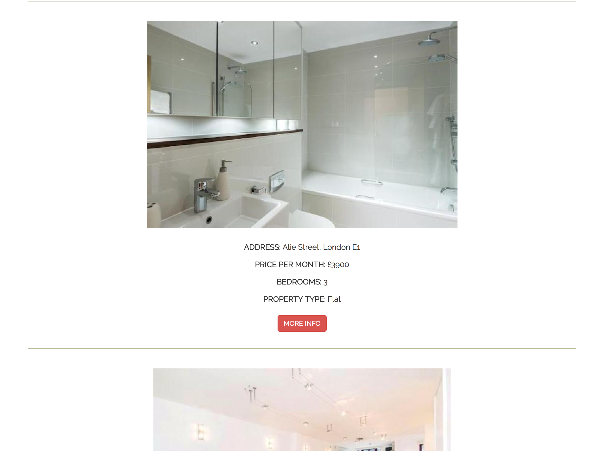
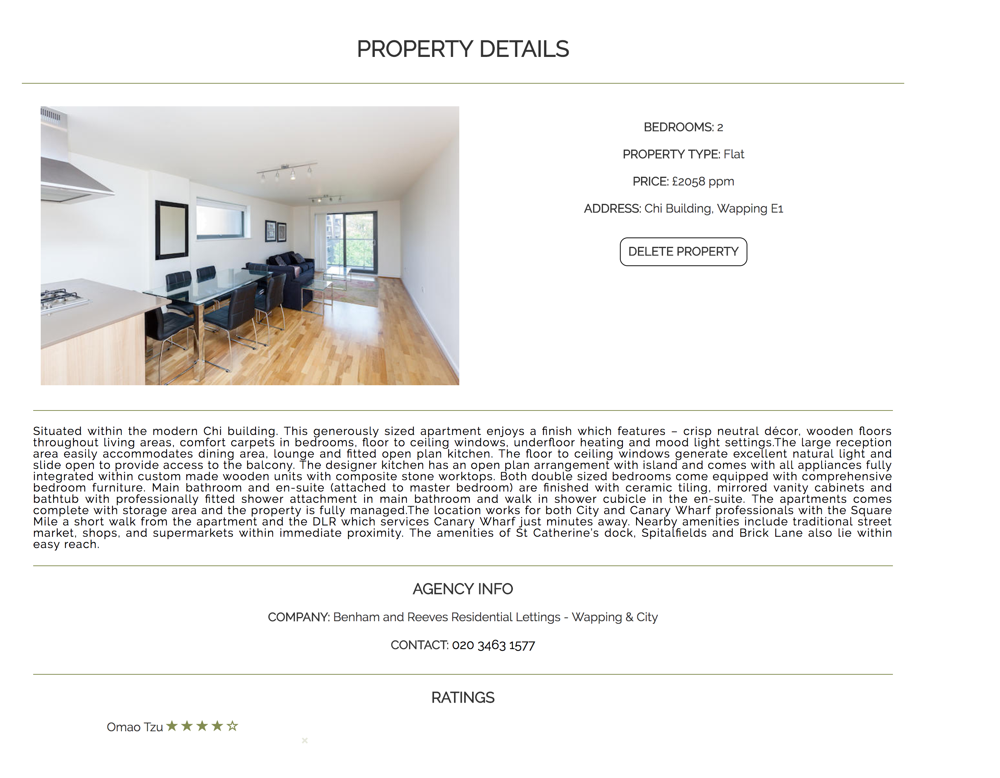
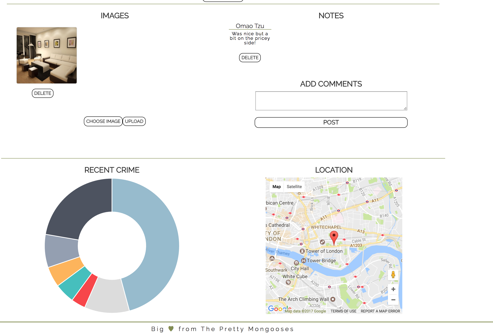

# Project 3
Raiden Dilan
Mark Davis
Omar Harvey-Phillips

## pNcApp

GA WDI London - Project 3 (Group Project)

For the third project we were tasked with creeting a MEAN stack app in groups. The aim was to improve our ability to work as a team and get good at git management.

After some discussion we settled on the idea of having an app that helped users who were looking to flat share and move into a new property whilst also feeding back information about local crime in the area. pNc was a shorthand we gave it for 'Props And Cops' due the the crossover of both forms of information

[See it here!](https://pncapp.herokuapp.com/)

### Approach / How it works

The aim was to create a website for groups of people looking to live together but enable each member of the group to go and view a property on their own or without other members and give feedback and take photos,

Users would have to register and login in order to be about to use this app due to the nature of the content. After registering they would be able to create a group or be added to a group by other users. Each member of a group could browse properties by area and number of beds required and add it to the groups portfolio.

Poperty information was aquired using the Zoopla API and crime statistics provided by the UK Street Crime API.

I focused a lot on the Zoopla API, authentication and bug fixing throughout the project flipping between back and front end when required. 

##Technologies Used

JavaScript, SCSS, HTML, Express.js, AngularJS, Node.js, MongoDB, Mongoose, Bcrypt, AJAX, JSON, AWS, Zoopla API, Google Maps API, Police Crime API, Bootstrap, Gulp

Colour coordination was established by using Coolers and the landing page image was taken from Unsplashed.

The Google Web Font 'Raleway' was used to style the site.

### Problems & Challenges

The most difficult problem that we encountered was dealing with populating each group with user ids thus meaning that each member could add to the portfolio. After several days we ended up using a prelifecycle hook to virtually populate the group with users after attributting the group id to each user upon its creation! -- My mind was blown away with how cool this was.